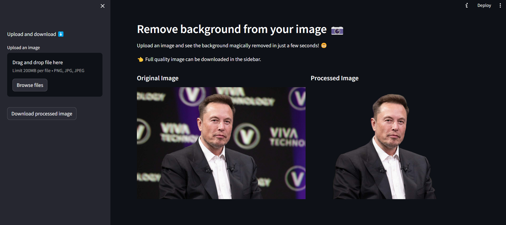

# Image Background Removal 

This project is an end-to-end image background removal web application. 

<br>

# Development Pipeline

The development followed the pipeline below, simulating an actual client deliverable. Requirements, planning and deliverable documents can be found [here.](https://devitolucas.notion.site/Background-removal-app-72496145b29e40559d9bb9d2491e230e?pvs=4) Development inspired by [computervisioneng](https://github.com/computervisioneng/image-background-removal-api-end-to-end-pipeline)

 

 <br>


# Web Application

Deployed with Streamlit, the web app lets users upload image files and download the same image with no background.

[](https://nobackground.streamlit.app/)



<br>

# Background Removal

The backbone for the background removal algorithm was develpoed by [rembg.](https://github.com/danielgatis/rembg)

The project is comprehensive, open-source and available as a Python package. 
<br>
Installation:

```python
pip install rembg
```
Implementation
:

```python
from rembg import remove

input_path = 'input.png'
output_path = 'output.png'

with open(input_path, 'rb') as i:
    with open(output_path, 'wb') as o:
        input = i.read()
        output = remove(input)
        o.write(output)
```

# Installation
To get started, you'll need to clone this repository and set up a new virtual environment:

```shell
git clone https://github.com/lucasdevit0/Background-Removal
cd Background-Removal
python -m venv .venv
.venv\Scripts\activate
pip install -r requirements.txt
```
